学生成绩管理系统
========
__注册密码：2014052421__

* `studata.txt`：学生数据文件，保存学生姓名学号成绩等信息
* `admintea.txt`：教师登录文件，保存教师账号和密码
* `adminstu.txt`：学生登录文件，保存学生账号和密码

功能展示与介绍
--------

###概述：
综合运用C语言基础知识，利用预处理、数据类型、自定义函数、结构体、链表、文件操作、WindowsAPI等，初步实现了教师与学生两种操作模式下成绩的录入、修改、删除、查询、排序、保存，以及切换登陆模式、退出等功能，并且在修改、删除、查询、排序功能中可按照多种方式操作。如可根据姓名或名字对成绩进行修改、删除，查询可分为个人成绩查询，分数段查询与不及格成绩查询，排序功能实现按照学号、姓名、五门成绩、总分、绩点，可由大到小或由小到大进行排序。同时，本学生成绩管理系统使用WindowAAPI实现鼠标操作，告别繁琐笨重的键盘，以整齐的区域化布局提供用户友好的操作界面，既解决了由于键盘输入不合法造成的错误，又符合用户的使用习惯。

###登录界面：


上图为运行程序后的初始登录界面。可以选择教师或学生登录，教师权限较大，可进行所有操作。学生只提供查询功能。在登录之间必须注册账号，只有拥有[注册密码](#学生成绩管理系统)的教师或同学才能注册账号。

###注册与登录：


上图进行教师注册，__规定密码长度小于等于15__，程序内没有进行密码长度校验。若两次密码不一致，账号(工号)已经被注册或注册密码错误，则提示相关信息


登录成功，按任意键进入操作菜单

###主界面：
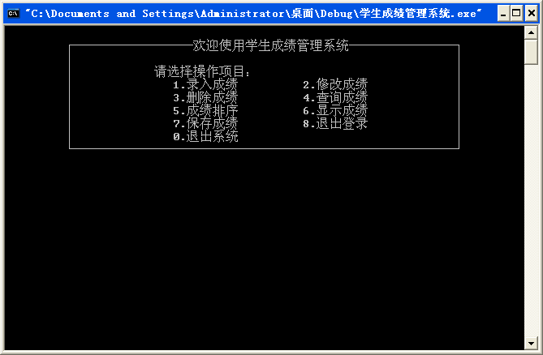

在主操作菜单中，包含__`录入成绩`__、__`修改成绩`__、__`删除成绩`__、__`查询成绩`__、__`成绩排序`__、__`显示成绩`__、__`保存成绩`__七大功能，以及__`退出登录`__与__`退出系统`__两个其他操作。接下来将一一介绍。

###录入成绩：


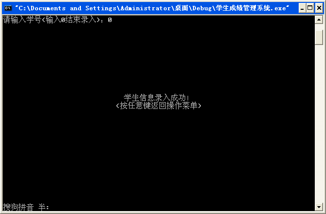

不限定输入人数，以学号为0判定是否输入结束。根据提示依次输入学生信息，输入结束后按任意键返回菜单。此功能暂不提供姓名与学号重复和长度校验，分数学分的区间校验，以及编号长度校验是程序的一大BUG,有待日后完善

###修改成绩：


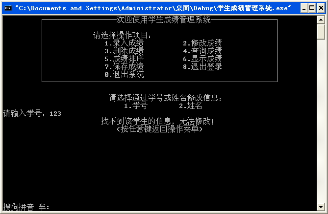

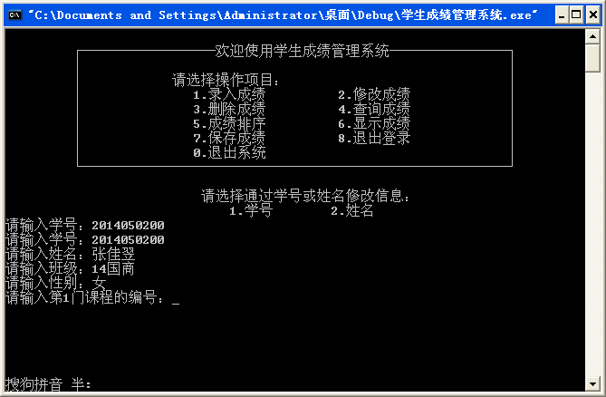

可选择根据学号或姓名修改学生信息，若查无此人，则提示错误并结束修改操作，否则可根据提示修改全部信息(是的，如果不想修改某处信息，则填上之前的数据)

###删除成绩：
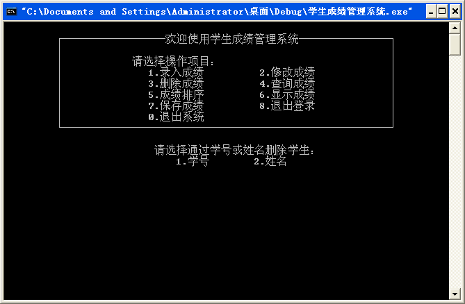

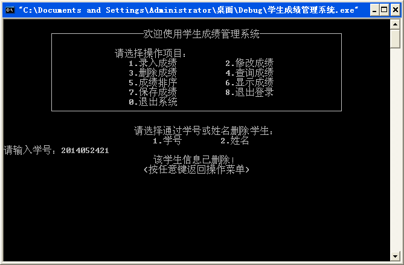

删除成绩与修改成绩类似，可选择根据学号或姓名删除学生，若查无此人，则提示错误并结束操作，否则删除该学生__(如果有确认删除的提示会更好)__

###查询成绩：


上图为查询成绩界面，有三种查询方式可供选择：个人成绩，分数段成绩和不及格成绩。

###个人成绩查询：
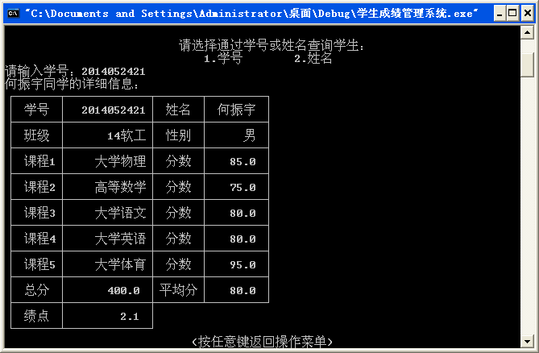

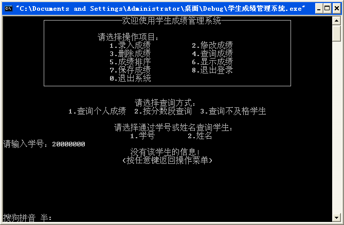

个人成绩可根据学号或姓名查询，查有此人则返回该同学详细信息，否则提示没有该学生。

###分数段查询：


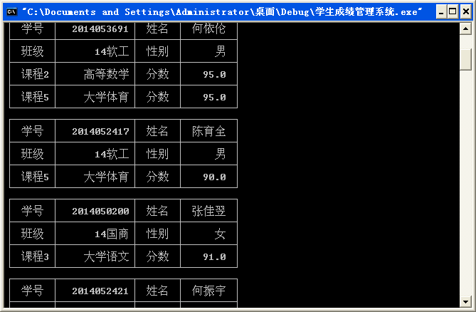

分数段查询要求输入分数下限和分数上线，则系统会返回所有人在这个分数区间(闭区间)内的所有科目成绩。

###不及格成绩查询


返回所有人所有不及格的科目

###成绩排序


支持多种关键字排序，根据提示选择关键字与排序顺序即可完成操作，排序结束后会询问时候显示所有人成绩，若是则调用第六个功能显示成绩，否则返回主菜单。__排序完的成绩并没有立即保存回文件__

###显示成绩
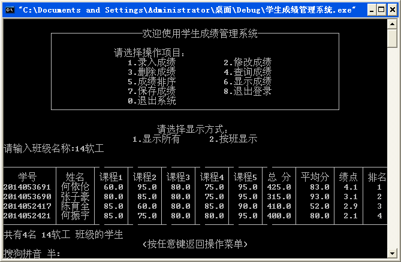


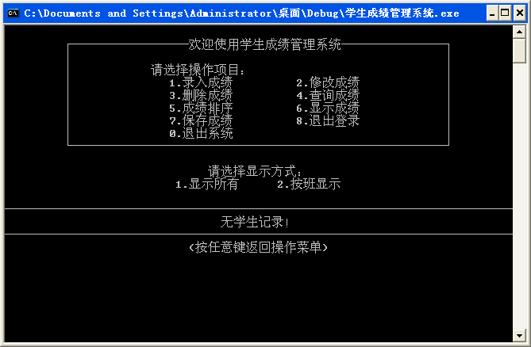

可选择显示所有同学成绩或按班级显示成绩。若无学生，则提示无学生记录，否则格式化打印学生成绩并统计人数显示在左下角

###保存成绩


手动保存成绩，将学生成绩保存到外存文件`studata.txt`中

###退出登录


若成绩未修改或已保存修改，则正常返回登录界面，否则询问用户是否要保存修改。

###学生操作界面
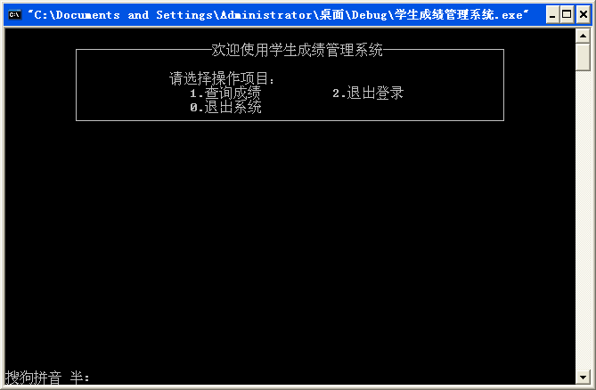

若选择学生登录，则只有[查询成绩](#查询成绩)的功能。

代码细节与实现
--------

###学生结构体：
```c
typedef struct stu{
	int num;									//学号
	char name[11],sex[5],cla[20];				//姓名，性别，班级
    struct cou les[5];                       	//5门课程
    double all,average,mark;                    //总分，平均分，绩点
	struct stu *next;
}STU;
```

###课程结构体：
```c
typedef struct cou{
	int lesnumber;								//课程编号
    char lesname[41];      						//课程名字
    double score,point;     					//分数,学分
}COU;
```

###宏定义：
```c
#define NAME 0
#define NUMBER 1
#define ALL 2
#define MARK 3
#define COU1 4
#define COU2 5
#define COU3 6
#define COU4 7
#define COU5 8
#define FROMBIG 0                  //从大到小
#define FROMSMALL 1      	       //从小到大
```

本程序使用动态链表(无虚头结点)作为学生记录的数据结构，通过对链表的增删改等操作实现对学生记录的管理。每个记录包含学生姓名、学号、性别、班级、五门课程、总分、平均分、绩点等记录项__(其中学号是int类型而不是char[]类型)__。本程序包含windowAPI库，支持鼠标操作是程序一大亮点。

###函数说明：
```c
int RegisterTea();      						 //教师注册
int RegisterStu();      						 //学生注册
```
根据提示要求用户输入账号(学号)和密码，匹配成功返回1，匹配失败返回0。使用`scanf`输入，不能输入空格等分隔符，没有密码长度的校验，密码是明文，但有控制账号不能重复

```c
int Count(STU *head);
```
遍历链表，计算链表节点个数，即学生人数，可用于判断是否有学生记录或学生人数是否增加

```c
int StuNum(STU *p,double low,double high);
```
计算某学生分数在[low,high]之间的科目数量，用于分数段查询和不及格查询

```c
void DisplayAll(STU *head);						 //打印所有学生信息
```
遍历链表，若链表为空，则打印“无学生记录”，否则打印所有学生的学号、姓名和五门课程的成绩、总分、平均分和排名__(其实不是排名只是序号而已)__

```c
STU *Search_name(STU *head,char *name);		     //通过名字搜索学生
STU *Search_num(STU *head,int num);		   		 //通过学号搜索学生
```
顺序遍历链表，若搜索到匹配的学生返回该节点的指针，否则返回NULL

```c
void DisplayOne(STU *head,int n,char *name);     //打印一个学生详细信息
```
形参head为链表头指针，n可选择`NAME`或`NUM`作为关键字的类型，name作为学生搜索的关键字。如打印名字为"ABC"的同学的信息，则`DisplayOne(head,NAME,"ABC")`若查找不到该同学，则打印"没有该同学的信息"，否则打印该同学学号、姓名等所有信息

```c
void DisplayCla(STU *head,char *class);			 //按班级显示学生信息
```
遍历链表，查找是否有班级为class的学生，若无则打印“无班级为class的学生”，否则打印班级为class的所有学生

```c
void DisplayGrade(STU *head,double low,double high);			//按分数段查询成绩
void DisplayFail(STU *head);					 //不及格科目查询
```
不及格成绩是分数段成绩的特殊情况，其实只要调用`DisplayGrade(head,0,59)`就好了。若无该分数段的学生则打印"没有学生"，否则以详细信息的形式打印所有学生分数在该区间的所有科目

```c
STU *Delete(STU *head,int n,char *name,int *item);	//删除学生成绩
```
形参中n是关键字类型，可选择`NAME`或`NUM`,name是用于搜索的关键字，item接收一个整型信号，若item为0，则表示没有找到该学生，删除失败；若item为1，则表示已成功删除该学生。返回类型为学生节点STU，表示新的链表头指针(若删除的是链表的第一个节点，则需要更新头指针)

```c
int Modify(STU *head,int n,char *name);			//修改学生信息
```
形参中n是关键字类型，可选择`NAME`或`NUM`,name是用于搜索的关键字，调用`Search_name`或`Search_num`查找该学生，若该学生不存在则修改失败，返回0，否则依次修改学生的所有信息，返回1表示修改成功

```c
int Save(STU *head);					//保存成绩
```
将链表里的所有学生节点格式化输出到__文本文件__`studata.txt`中保存


ASCII编码，不能UTF-8编码 
会判断文件开头和末尾的空行，不能判断中间的空行 
main函数太杂太长 
鼠标操作,不能键盘操作
文本文件
分数没有控制在0~100
没有控制学生信息中学号与姓名不能重复
此功能暂不提供姓名与学号重复校验，分数学分的区间校验，以及编号长度校验
修改成绩全部修改

##[回到顶部](#学生成绩管理系统)
